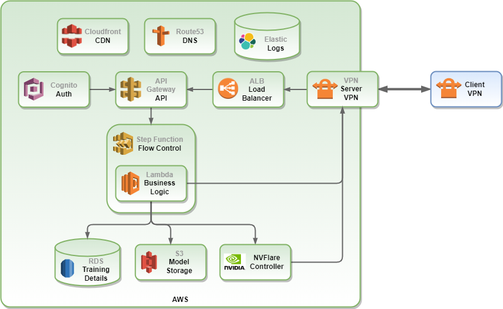
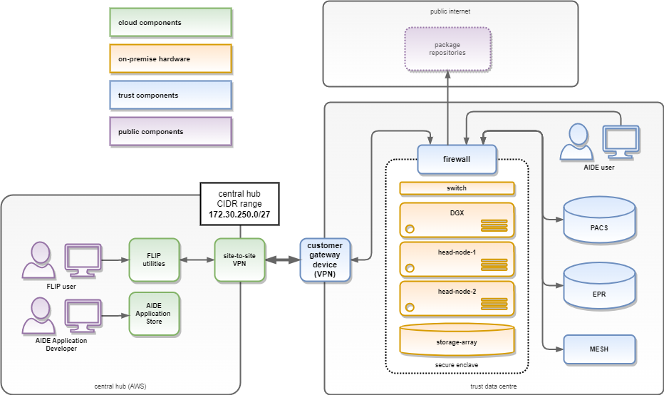

# Table of Contents
- [Overview](#overview)
- [Architecture](#architecture)
  - [Summary](#summary)
- [Central Hub](#central-hub)
- [Secure Enclave](#secure-enclave)
- [Components](#components)
  - [Central Hub API](#central-hub-api)
  - [Lambdas](#lambdas)
  - [Kubernetes](#kubernetes)
  - [OMOP](#omop)
  - [XNAT](#xnat)
  - [NVFlare](#nvflare)
- [Security](#security)
- [Environments](#environments)
  - [Local](#local)
  - [Dev](#dev)
  - [SIT](#sit)
  - [UAT](#uat)
  - [Pre-prod](#pre-prod)
  - [Production](#production)
    - [GSTT](#gstt)
    - [KCH](#kch)
    - [East Kent](#east-kent)
    - [Imperial](#imperial)
    - [UCLH](#uclh)
- [Process Flow](#process-flow)
  - [FLIP Workflow](#flip-workflow)
- [Logging](#logging)
  - [Elasticsearch](#elasticsearch)
  - [Cloudwatch](#cloudwatch)
  - [Kibana Access](#kibana-access)
  - [Sample Kibana Queries](#sample-kibana-queries)
- [Data](#data)
  - [Data Catalogue](#data-catalogue)
  - [New Data Points](#new-data-points)
    - [Example](#example)
- [Deploy](#deploy)
  - [Octopus](#octopus)
  - [Terraform](#terraform)
  - [Ansible](#ansible)
  - [GitHub](#github)
- [Restore / Redeploy](#restore-redeploy)
- [Access](#access)
  - [How to set up new FLIP Accounts](#how-to-set-up-new-flip-accounts)
  - [RBAC](#rbac)
    - [Administrator](#administrator)
    - [Model Developer](#model-developer)
- [New Sites](#new-sites)
  - [Add a new Site to FLIP](#add-a-new-site-to-flip)

#
# Overview
This Support Documentation aims to provide an overview of the FLIP application, detailing how it is architected and deployed and any information required for further support and development.

# Architecture
## Summary
The overall FLIP solution comprises three main features:
1. A **Cloud-hosted Central Hub** providing researchers with the capability to define machine learning projects, discover appropriate datasets at participating Trusts and federate the testing and training of relevant models across Trusts, culminating in the aggregation of a consensus model.
2. A **Secure Enclave** hosted on premise at each individual Trust providing a highly secure environment designed to solely permit requests for training from the Central Hub. A set of FLIP microservices are hosted within the Secure Enclave to handle these requests, scheduling and managing workload for the bespoke compute resources.
3. A **high performance compute stack** designed specifically for the rapid testing and training of machine learning models. This consists of a number of powerful GPUs and a cluster of head nodes to receive requests from the FLIP microservices and orchestrate the compute resource.

# Central Hub
The Central Hub is a cloud-hosted environment which provides researchers with the capability to identify a cohort and initiate requests to train models in a federated setting. Role based access controls ensure that users will only be able to access their specific data. 

Researchers can define the cohort of data they wish to use for training and testing based on data from the available Trusts, view statistics about the available data, tweak and refine their query, and ultimately decide on a dataset on which to train and test their model. Following this, the model is distributed, trained and tested within the Secure Enclave at each selected Trust before the resultant model is centrally aggregated.

The Central Hub implements a serverless architecture to take advantage of the natural horizontal scaling that cloud hosting provides. All business logic is implemented as serverless Lambdas, controlled by Step Functions.

# Secure Enclave
The Trust component of FLIP runs in a Secure Enclave at each Trust to facilitate the secure training and testing of the models on the high-performance GPU hardware.

As per the security principles, no personally identifying data will leave the Secure Enclave.

FLIP implements a microservice-based architecture. The Image Service, Import Service and Data Service are deployed as Dockerised microservices, running in Kubernetes, orchestrated by a FLIP API.

# Components
## Central Hub API

[TODO: List Central Hub API endpoints and their responsibilities - dev team]

## Lambdas

[TODO: List the Lambdas that we have defined and their purpose - dev team]

## Kubernetes
All client-side services deployed into the Secure Enclave are running as Dockerised components in Kubernetes. These are deployed and configured using Terraform scripts for infrastructure and Ansible playbooks for installation and configuration.

## OMOP
The OMOP Common Data Model ([https://www.ohdsi.org/data-standardization/](https://www.ohdsi.org/data-standardization/)) describes a common format and representation of data that allows data from different systems that may have hugely different structures of data to be analysed more easily.

A Common Data Model is needed as Trust datasources will have different formats, structures and representations of data depending on their primary need. To allow for research, assessing and analysing data, a common data model is needed.

The OMOP CDM is implemented as a PostgreSQL database in the Data Centre at each Trust.

## XNAT
XNAT is an open-source platform for neuroimaging research and processing. The primary functionality of XNAT is to provide a place to store and control access to neuroimaging data such as DICOM series images. This includes user control, search and retrieval and archiving capabilities.

XNAT enables quality control procedures and provides secure access to storage of data.

XNAT includes a pipeline engine to allow complex workflows with multiple levels of automation. This can include things such as converting DICOM to NIfTI file formats.

## NVFlare
The Federated Learning functionality is provided by Nvidia’s NVFlare solution ([https://github.com/NVIDIA/NVFlare](https://github.com/NVIDIA/NVFlare)). NVFlare is deployed in a collection of ‘nets’, with a net consisting of a central controller with a worker at each of the Trusts. Each net will have access to a GPU at each of the Trusts to accelerate the model training.

Training jobs will be distributed to the NVFlare controller in a net from a FLIP-administered queue, whereupon the worker nodes in the net will communicate with the controller and co-ordinate the training.

## Security

All traffic between the Central Hub and the Secure Enclaves are secured via the means of tunnelling through a VPN tunnel, linking both the Central Hub and the Secure Enclaves. 

This VPN tunnel means that all traffic is encrypted with at least AES-256 encryption, while traversing between the locations.

The following is the list of ports required to be opened for the Secure Enclave communication:

# Environments
## Local

[TODO: how to set up and work on FLIP for a developer - dev team]

## Dev
[TODO: Location (URL) of dev resources and how to access / deploy to - dev team]

## SIT
[TODO: Location (URL) of SIT resources and how to access / deploy to - dev team]

## UAT
[TODO: Location (URL) of UAT resources and how to access / deploy to - dev team]

## Pre-prod
[TODO: Location (URL) of pre-production resources and how to access / deploy to - if this is going to be persistent post-completion - dev team]

## Production (Trust Specific)
[TODO: How to access and deploy to each of the Trusts - devops]

### GSTT

### KCH

### East Kent

### Imperial

### UCLH

# Process Flow
## FLIP workflow
Once a user has access to FLIP, they can construct a project, add project members and execute an SQL query at each of the consortium Trusts to determine data cohort sizes.

If a sufficient cohort of data can be utilised, the Model Developer will upload their training and validating algorithms to FLIP, along with any other collateral required for training and testing. The Model Developer will indicate which Trusts’ data they require and ‘stage’ the project, awaiting approval from the Trusts that their data can be used for the project.

Once a FLIP administrator has approved the project, FLIP will execute the cohort query at each of the selected Trusts to determine the DICOM series associated with the cohort and begin to copy the images from the Trust PACS system to the local XNAT cache.

Once the DICOM series have been cached in the local XNAT in each Secure Enclave, the Model Developer will be notified and they can begin the optional process of enriching the data. All users associated with the FLIP project will be provided with XNAT accounts and will be able to log in locally and segment, align, label or otherwise enrich the data prior to providing it to the algorithm for training. Only those users in the original FLIP project will have access to the images in the XNAT repository.

Once all images have been prepared, the Model Developer will be able to initiate the training process. The uploaded files will be deployed out to each of the Trusts and the algorithm will be provided with a dataframe containing the details of the selected cohort. The algorithm will be able to inspect the dataframe and request images from the XNAT cache for training purposes. Any image processing performed during the training process can potentially be written back to the XNAT project for future training cycles.

Between training cycles, the weighted model will be sent back to the Central Hub to be aggregated and redistributed out to the workers.

Once all training cycles are completed, the final weighted model and any recorded metrics will be made available to the Model Developer through the FLIP UI.

# 
# Logging
## Elasticsearch

All logs created through the FLIP components running in Kubernetes within the Secure Enclave will be aggregated together into the Elasticsearch index hosted within each Trust Secure Enclave. These logs will be shipped to the Central Hub where Answer Support staff will be able to construct queries in Kibana to interrogate the logs.

## Cloudwatch

All AWS components in the Central Hub will output their logs to Cloudwatch. This will aggregate the logs and allow central querying. Logs will also be shipped to the central Elasticsearch index to allow for cross-source querying and reporting.

## Kibana access

[How a user would get access to Kibana - dev team]

## Sample Kibana Queries

[A sample Kibana query - produce once deployed]

# 
# Data

## Data Catalogue

The Data Catalogue was compiled from the data requirements of the models shortlisted for deployment out to FLIP. Data points were categorised into mandatory and optional - as many of the mandatory requirements as possible have been included in the initial data load, future enhancement to FLIP will include further data points.

[Link to Data Catalogue](https://docs.google.com/spreadsheets/d/1wrFozOs4agLSqG4c0fS2YAsccVqQ4WMZWa2zVGOlJ0g/edit#gid=0)

## New Data Points

New data points can be added into FLIP for the purposes of refining cohort selections or improving model training results. The following steps should be followed to add a new data point to FLIP:

* Advise each Trust in the consortium of the requirement for the additional data
* Liaise with the Trusts to update the T-FLIP component to include the new data point in a message
* Update and deploy the FLIP endpoint to accept the new data point
* Update the mapping in FLIP to define where the data point should be stored in the OMOP Common Data Model

### Example
A future requirement is discovered to add in the ‘Height’ data point to FLIP. The location of the data point should be determined at each Trust and the T-FLIP component updated to accept it.

The FHIR message and endpoint in FLIP should be updated to accept the new data point.

The mapping within FLIP will be updated to store the new data point in the correct location in OMOP.

<table>
  <tr>
   <td>T-FLIP field
   </td>
   <td>OMOP field
   </td>
   <td>Details
   </td>
  </tr>
  <tr>
   <td>patient_dob
   </td>
   <td>person.year_of_birth, person.month_of_birth, person.day_of_birth
   </td>
   <td>1-based index for month
   </td>
  </tr>
  <tr>
   <td>patient_dod
   </td>
   <td>observation.observation_concept_id,

observation.observation_date
   </td>
   <td>observation_concept_id = 4265167, observaton_date = DOD
   </td>
  </tr>
  <tr>
   <td>patient_diag
   </td>
   <td>observation.observation_concept_id
   </td>
   <td>SNOMED code relating to the diagnosis
   </td>
  </tr>
  <tr>
   <td><strong>patient_height</strong>
   </td>
   <td><strong>person.height</strong>
   </td>
   <td><strong>Height in metres</strong>
   </td>
  </tr>
</table>

# 
# Deploy
## Octopus

[notes on Octopus deployment of FLIP - dev team]

## Terraform

[notes on Terraform deployment of FLIP - devops team]

## Ansible

[notes on Ansible deployment of FLIP - devops team]

## GitHub

All code related to the FLIP software and infrastructure as code scripts is stored in GitHub repositories.

[list and note on the various repositories - dev team]

# Restore / Redeploy
The backup / restore policy for FLIP involves restoring the data from backup once software components have been redeployed. As all data for FLIP is stored on the specific data partition in the FLIP hardware, which is backed up by each individual Trust to the Trust schedule, then following a failure the FLIP components would be redeployed followed by requesting that the Trust restore the data partition from backup.

# Access
## How to set up new FLIP accounts

Access to FLIP is granted by a FLIP administrator - these are currently:

[list of FLIP contact details for administrators - Haleema / Jawad?]

Access to FLIP will be reviewed annually, with dormant accounts being removed.

## RBAC

FLIP employs role based access control to permit functionality for accounts, this is handled by AWS Cognito through the FLIP UI. FLIP currently has two access profiles, **Administrator** and **Model Developer**. 

### Administrator

FLIP Administrators have permissions to:

* Create new FLIP user accounts 
* Modify the permissions of existing user accounts
* Approve existing projects

### Model Developer

Model Developers have the following permissions:

* Create new projects
* Add existing users to projects
* Submit projects for approval
* Train models

# New Sites

## Add a new site to FLIP
