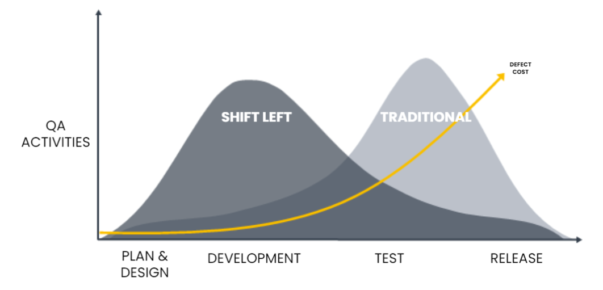
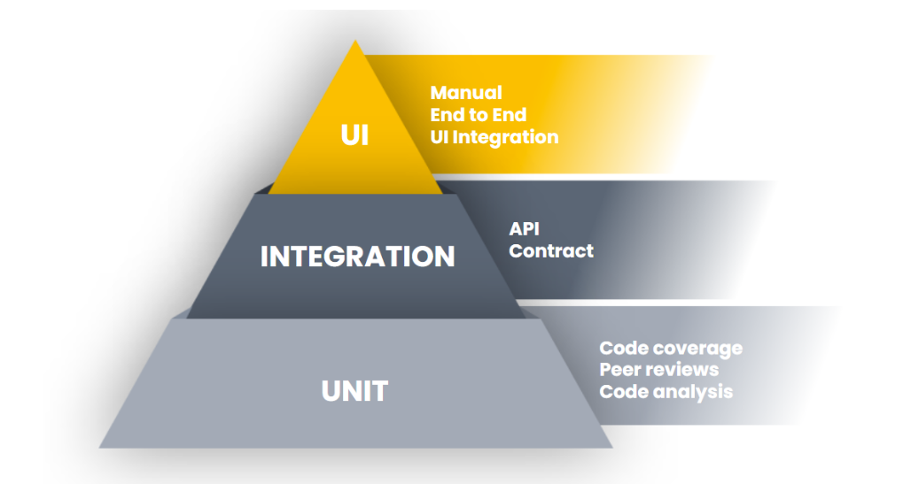
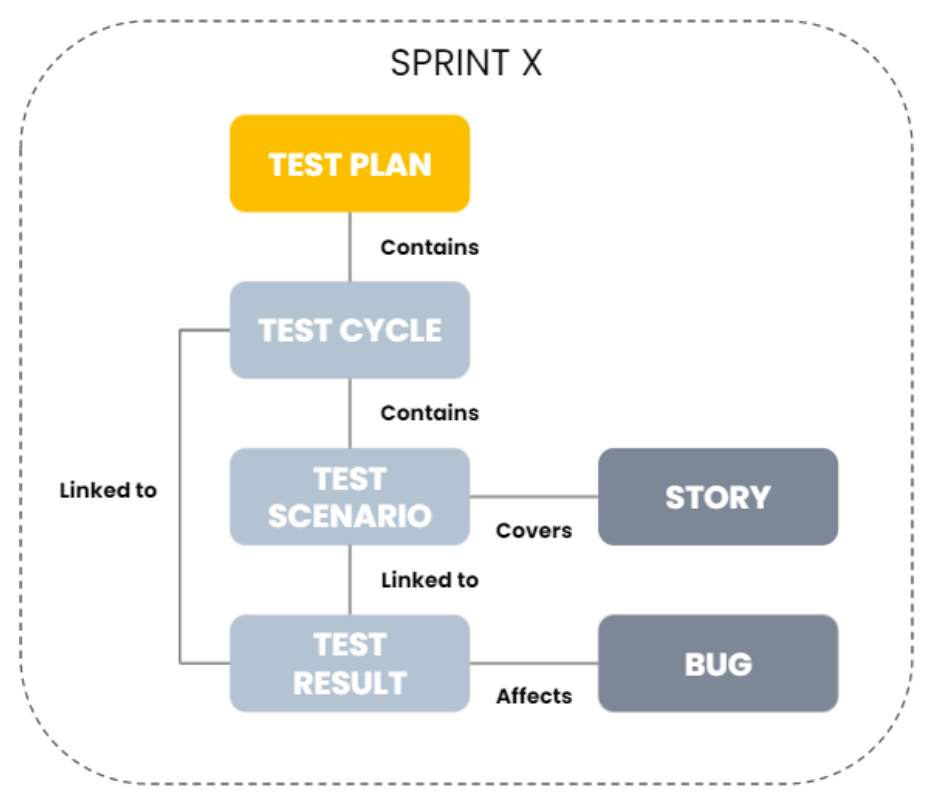
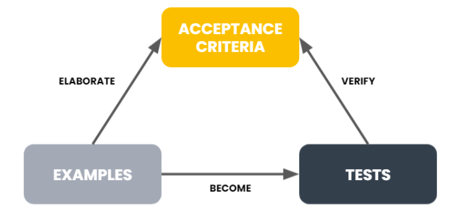
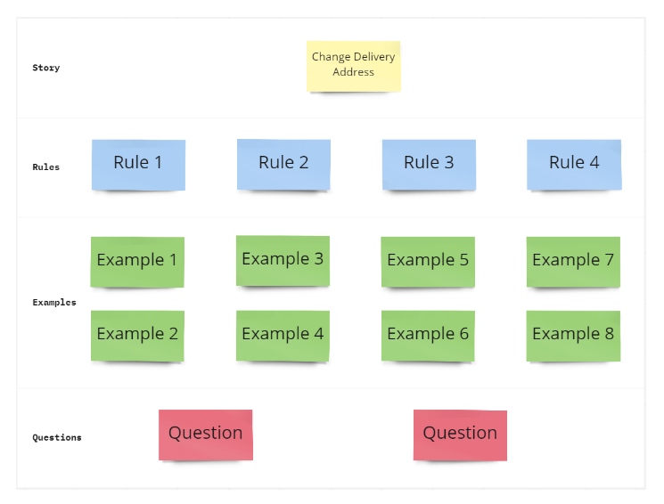
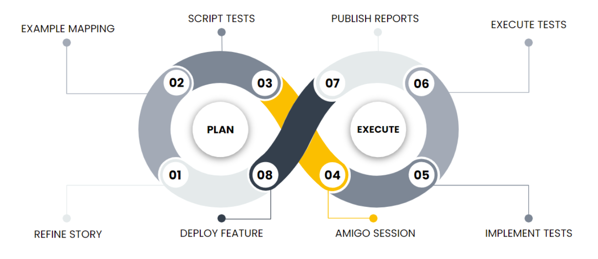
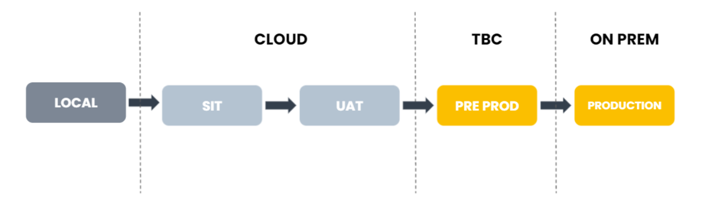

# Table of contents

- [Executive Summary](#executive-summary)
- [Document Purpose](#document-purpose)
- [Project Overview](#project-overview)
- [Test Approach](#test-approach)
  - [Test Principles](#test-principles)
  - [Test Methodology](#test-methodology)
    - [Shift Left](#shift-left)
    - [Multi Layered Testing](#multi-layered-testing)
    - [Continuous Testing](#continuous-testing)
  - [Functional Testing](#functional-testing)
    - [Unit Testing](#unit-testing)
    - [Database Testing](#database-testing)
    - [API Testing](#api-testing)
    - [Contract Testing](#contract-testing)
    - [UI Integration Testing](#ui-integration-testing)
    - [End To End Testing](#end-to-end-testing)
    - [Manual Testing](#manual-testing)
  - [Non-Functional Testing](#non-functional-testing)
    - [Security Testing](#security-testing)
    - [Performance Testing](#performance-testing)
    - [Benchmark Testing](#benchmark-testing)
    - [Load Testing](#load-testing)
    - [Accessibility Testing](#accessibility-testing)
- [Test Design](#test-design)
  - [Agile Test Plans](#agile-test-plans)
  - [Gherkin Syntax](#gherkin-syntax)
  - [Acceptance Test Driven Development (ATDD)](#acceptance-test-driven-development-atdd)
    - [Example Mapping](#example-mapping)
- [Test Process](#test-process)
- [Test Deliverables](#test-deliverables)
  - [Sprint Test Report](#sprint-test-report)
  - [Milestone Test Report](#milestone-test-report)
  - [Others](#others)
- [Test Tools](#test-tools)
- [Defect Management and Triage Process](#defect-management-and-triage-process)
  - [Bug Tickets](#bug-tickets)
  - [Defect Dashboard](#defect-dashboard)
  - [Defect Calls](#defect-calls)
  - [Defect Report](#defect-report)
  - [Defect KPI Report](#defect-kpi-report)
  - [Severity Categorisations](#severity-categorisations)
- [Environments and Data](#environments-and-data)
  - [AIDE](#aide)
  - [FLIP](#flip)
- [Scope](#scope)
  - [In Scope](#in-scope)
  - [Out of Scope](#out-of-scope)
- [Roles and Responsibilities](#roles-and-responsibilities)

#
# Executive Summary

Answer Digital (AD) promotes a collaborative testing culture. This will be achieved by implementing an Acceptance Test Driven Development (ATDD) automation framework. Tests will be created in example mapping sessions and will focus on testing the behaviour of a feature through test scenarios written in plain English. This will enable non technical stakeholders to review and help create automation test scenarios. Increasing the visibility of the test scenarios will establish test transparency and shorten UAT cycles as stakeholders have reviewed and defined the test coverage. Test Scenarios will be attached to User Stories and reports will be produced to demonstrate that the agreed coverage is executed for every release.

By adopting a Shift Left approach and testing earlier in the software delivery cycle, defects will be found and remedied earlier, reducing costs and the chance of potential delays. Security testing will be implemented from the start of the project and will be executed iteratively, removing the need for lengthy end-of-project security test cycles. The outcome of shifting left is producing production ready software as soon as possible.

An automation suite will be created and executed continually to identify issues quickly and accurately. This will reduce the release time to a higher environment, negate the need for extended manual regression testing and increase the overall quality of the solution. Continuous testing, through automation, will increase confidence in releases.

#
# Document Purpose

This document details the test practises to be undertaken by Answer Digital and the AI Centre in order to deliver the FLIP and AIDE solutions. It defines the test approach, test objectives and how those objectives will be achieved. It is to be used by FLIP and AIDE stakeholders to remove any ambiguity in the approach to quality assurance. It will be used by QA engineers who will plan and execute tests to a high standard and in a timely manner. 

This document will continue to be updated throughout the lifetime of the project, drawing on improved levels of knowledge and insight on requirements for ensuring quality of the delivered solutions. This information will be maintained in a shared knowledge repository, utilising Atlassian Confluence.

#
# Project Overview

The London Medical Imaging & AI Centre for Value Based Healthcare have commissioned an AI programme involving a consortium of 10 NHS Trusts, with the objective of increasing efficiency and improving patients’ outcomes through advanced diagnostics and identification of personalised treatments.

King’s College London and Guy’s and St Thomas’ NHS Foundation Trust are leading the consortium to develop an artificial intelligence based Federated Learning and Interoperability Platform (FLIP) for diagnostic imaging, and an Artificial Intelligence Deployment Engine (AIDE) for real world AI clinical deployment. This platform will provide the toolset for the AI Centre, enabling researchers and clinicians to transform and deploy advanced diagnostic pathways.

The programme is split into the following components:

- **AI Deployment Engine (AIDE)**: enabling NHS Trusts to deploy AI products in clinical practice.
- **Federated Learning and Interoperability Platform (FLIP)**: enabling NHS Trusts to make their data accessible, without compromising patient confidentiality to develop AI tools.
- **Secure Local Enclaves**: putting in place in each partner trust the infrastructure required to build a secure data enclave to enable algorithms to train securely.

#
# Test Approach

## Test Principles

- FLIP and AIDE solutions are quality assured using a Shift Left testing approach in order to reduce costs and defect leakage.
- DevSecOps best practices are implemented into the CI/CD pipelines.
- Test coverage is designed in collaboration with the product owner and Key Cross-Trust User groups.
- Automation is favoured over manual testing, with an automated regression suite built iteratively.
- Automation is developed in the sprint alongside development.  
- Any release candidate is fully regression tested before being delivered.
- Features are only released when they have met the agreed scope of Testing.
- Any severity 1 and 2 defects are fixed before the release of a feature.
- Any open severity 3 and 4 defects have a workaround attached, agreed with the product owner.
- Reporting will be produced giving full transparency.

## Test Methodology

Scrum will be used as the software delivery methodology, and quality assurance will be at the heart of delivery. QA engineers will focus on testing new features in the sprint, help define the definition of ‘done’, create an iterative automation continuous testing suite and manage the overall quality of the FLIP and AIDE solutions.

## Shift Left

Quality Assurance practices will be implemented adhering to the Shift Left testing model. This is focused on performing testing as early as possible in the software development lifecycle to validate functionality being delivered is ‘production ready’. This reduces costs by identifying defects earlier, where remedial actions are most cost effective and decreases the possibility of project delay by taking a proactive approach towards quality assurance.

## Multi Layered Testing

To enable Shift Left and continuous delivery, automation is implemented adhering to the Automation Test Pyramid principles.

The automation pyramid is a guideline for outlining the frequency which functional tests should appear in an automated test suite. By following this, the automation suite will have increased stability and decreased maintenance costs. Automation ROI is improved with the lower levels of the pyramid being quicker to implement, having less integration and being faster to execute.

By implementing an automated multi layered testing suite, we achieve:

- Increased code quality with all changes being tested before a release
- Stable releases
- Increased automation ROI
- Reduced execution time, increasing the frequency of releases
- Solution documented through tests

## Continuous Testing

Continuous Testing is the process of implementing automation tests in the CI/CD pipeline, which are executed upon code check to validate the quality of a release candidate.

Executing automation tests in the build and release pipeline ensures that issues are identified as early as possible and are contained to a lower development environment. Any release candidate is pushed through this continuous testing process and is fully regression tested prior to any deployment.  

## Functional Testing

Functional testing will be carried out in line with the features being delivered. The type of testing required will be agreed before development work is started. 

## Unit Testing

Answer Digital keeps a very high standard of unit test code coverage. Unit tests will be written alongside feature development and reviewed as part of a pull request. Unit tests will be executed before code is merged into develop to ensure there is no regression in expected functionality.

## Database Testing

Database testing will involve checking the data integrity of any databases for both FLIP and AIDE solutions. Automated tests will be created to check that the databases adhere to the correct schema and the expected data is mapped  correctly. The tests will cover the following:

- Schema / Mapping validation
- Data transformation validation
- Stored procedure and view testing
- Manual verification of any PII masking
- Non-Functional inc. Security and Benchmark testing

## API Testing

Application Programming Interface (API) testing involves sending HTTP requests to the application under test and validating the response. This ensures a basic level of integration and provides assurance that the service layer of the application is functioning. The tests will cover the following:

- Ensuring the API is secure
- Ensuring the API is accessible by each user / system that requires the service 
HTTP response checking
- Payload testing, checking for different permutations of the expected requests and responses
- When API testing is required the following table will be attached to the ticket and populated to enable testing to occur as early as possible.

| Heading | Value |
|---|---|
| Endpoint | |
| HTTP Methods | |
| Parameters | |
| Request Body | |
| Status Code | |
| Headers | |
| Response Body | |
| Additional Fields | |

## Contract Testing

Contract tests will capture and store expected Request and Response interactions between two systems and store them in a JSON contract. Both the consumer (the requester) and provider (the responder) will run tests to prove that they are adhering to the service agreement before deploying a new version. This form of testing allows systems to be decoupled, tested thoroughly with mocked dependencies and deployed independently, giving proof that the contract is not broken.

## UI Integration Testing

Any front end development will be tested in isolation from the real services using UI Integration tests. These tests allow quick validation of the UI in a real browser with mocked external dependencies, which are initiated from the tests, to give the UI state.

Through UI Integration testing we can validate front-end edge cases earlier, where finding real data might be infeasible or difficult to set up. These tests will cover the following:

- Field level entry and validation
- Page submissions
- Page state with mocked service responses

Dependencies will be mocked using test doubles (stubs, data faking, mocks, test versions). The decision to implement a test double will depend on the use case of the feature.

## End To End Testing

End to End (E2E) tests are process driven and will be executed against a fully deployed application. The tests validate that business critical functionally has been deployed and is working as expected. These tests will cover the following:

- Business critical user journeys
- Browser and device validation
- Full fat environment with real services

## Manual Testing

QA Engineers will perform manual testing, when applicable, using the following two techniques:

- **Exploratory testing** - a tester explores an application within a given amount of time to ensure the look and feel of the application is satisfactory.
- **Session testing** - a session is scheduled for a tester to investigate a complex feature or new functionality based on a test plan

Manual testing will only be performed when it is deemed necessary or automation has a low ROI. Results will be recorded and attached to the corresponding Jira ticket.  

## Non-Functional Testing

Non Functional testing will be carried out in line with the features being delivered. The type of testing required will be agreed before development work is started and any non functional requirements will be documented in the AI Centre Non-Functional Requirements Document.

## Security Testing

For full details of Security Testing, please refer to the Security Management Plan.

## Performance Testing

Performance testing will be carried out to not only ensure that the product behaves as expected, but also performs as expected. Performance NFRs will be used to ratify this.

- Transactions will be categorised into complexity.
  - **Simple** - transactions which provide view only information.
  - **Medium** - transactions which perform updates or a page with multiple simple transactions.
  - **Complex** - transactions which perform large scale data updates or retrieval.
- Transaction complexity ratings will be agreed with the Product Owner and a performance NFR will be defined for each categorisation.
- 90th percentile response times will be reported including any failures.

The following will be reported after a performance test:

- **Lowest response time** - Lowest total time to send a request and get a response.
- **Highest response time** - Highest total time to send a request and get a response.
- **Average response time** - Average total time to send a request and get a response.
- **Concurrency** - The number of parallel requests over time.
- **Error rate** - percentage of requests resulting in errors compared to all requests.
- **Pass/Failed transactions** - A measurement of the total numbers of successful or unsuccessful requests.
- **CPU utilisation** - How much time the CPU needs to process requests.
- **Memory utilisation** - How much memory is needed to process the request. Depending on the architecture we should not be exceeding 40% memory utilisation. 

## Benchmark Testing

Benchmarking gives a quick and early view of performance at a modular level. These results can influence architecture and results are compared to later tests to validate any level of performance degradation incurred.

Benchmark tests do not require a verbose NFR and can be treated purely as a fact finding mission. These will be executed against individual components to build up a picture of performance and identify any bottlenecks.

## Load Testing

Load tests are designed to replicate the expected load on the application. The expected load for concurrent users, transactions and response times must be gathered and documented before load testing is undertaken. Load tests require planning and preparation and will only be conducted in a production-like environment and with prior agreement from stakeholders.

## Accessibility Testing

Manual Accessibility testing will be undertaken to assure that less able users can interact with the website, mobile or desktop application without hindrance. All UI modules will be tested against WCAG 2.1 standards to ensure they meet the recommended AA Level: Acceptable compliance for web based content. Results of these tests will be attached to the story for full traceability.

#
# Test Design

## Agile Test Plans

Agile Test Plans will be created iteratively using QMetry and will be accessible though Jira. This will keep Jira as a single source of truth and keeps the test plans inline with any updates to development tickets. Test Plans can also be exported upon request.

Test Plans will adhere to the processes outlined in this document and will be estimated as part of the backlog refinement and sprint planning sessions. Test Plans will include all Test Scenarios to be executed against a story within a sprint. Test execution will be targeted to be completed within the sprint. Any deviation from this expectation will be documented and escalated to Product Owners. Test scenarios will be linked to User Stories to give full traceability and visibility of execution status against a story.

## Gherkin Syntax

Where appropriate, Test Scenarios will be written using plain English syntax called Gherkin. Gherkin is implemented using Given - When - Then keywords and allows non-technical members of the project team to contribute to the test coverage by articulating a user journey using these keywords. This leads to several advantages:

- Gherkin is simple so everyone can contribute and own solution quality
- Steps are modular so automation is implemented faster
- Easy to understand which leads to simple effective reporting 
- Gherkin focuses on validating the business requirements

Below is an example of how these keywords are used to create a test scenario:

**Scenario**: I am writing a Gherkin test

**Given** I am on this page

**When** I perform this action

**Then** this thing happens

## Acceptance Test Driven Development (ATDD)

ATDD looks to bridge the gap between Acceptance Criteria and the tests which are executed to validate a feature’s behaviour. It will build on the Behaviour Driven Development principle of inclusion but moves that process earlier into the delivery process. The Amigos (Developer, QA Engineer, Product Owner and UX Designer) will work at least a sprint ahead to define tests which will prove the feature is behaving as expected, should they all pass. This is done in Example Mapping sessions. Designing tests before development has started gives a holistic view of a feature’s test coverage and enables development by example, removing any ambiguity.

The benefits to this approach are:

- **Inclusion** - Tests are generated as a team and everyone is invested in quality.
- **Clarity** - Developing by example ensures that the customer gets what they want.
- **Shift Left** - tests are designed earlier, removing any ambiguity in acceptance criteria.
- **Test-Driven** - Development code can only be accepted when all tests pass.
- **Increased Automation Coverage** - Tests are built up iteratively and collaboratively giving a large automated test coverage of features.
- **Code Reuse** - Given - When - Then keywords are bound to methods making them reusable in any feature file meaning that Automation becomes modular and faster to implement.

## Example Mapping

The Amigos will review a story in its entirety including any acceptance criteria and wireframes attached to the story. This information will be used to design a list of examples which are implemented as tests.

Example Mapping session rules:

- Session is timeboxed to 20 minutes.
- The Example Mapping board will be set up pre-meeting using the template in Miro (above). This will be done by the QA Engineer.
- Only relevant team members and stakeholders must attend the session - this does not limit the session participation but everyone must add value.
- Any questions raised must be answered before a story is accepted into a sprint.
- Miro board will be attached to the story for full traceability.
- Focus on high level examples, not the gherkin syntax. This will be done by the QA Engineer.

#
# Test Process

**01. Refine Story** - As a team, the story will be refined so that it has enough information attached in order to provide an estimate.

**02. Example Mapping** - The Amigos will develop a list of examples which validate the feature’s behaviour.  

**03. Script Tests** - A QA Engineer will develop the test scenarios for the examples, using their expertise to identify the best test type applicable for that example.

**04. Amigo Session** - The Amigos will have a final check of the stories’ Acceptance Criteria, the examples and test scenarios to create a full understanding before a line of code is written.

**05. Implement Tests** - Any automation tests will be implemented in parallel with the development work. No development will be allowed to be checked in without matching test coverage.

**06. Execute Tests** - Automated tests will be executed in the CI/CD pipelines to ensure that regression has not occurred. Any manual tests will be executed to validate the published application.

**07. Publish Reports** - A full execution report will be attached to the story to demonstrate that the tests, which correspond to the examples, have been executed successfully. Any bug reports will be created in Jira and will be managed through the agreed Agile development process.

**08. Deploy Feature** - A feature will be deployed when all tests are passed. The feature will be flagged off in higher environments. It is at the Product Owner's / Trust’s discretion as to when that feature is enabled.

#
# Test Deliverables

## Sprint Test Report

After every sprint a report will be generated detailing the following information:

- Stories and Tasks delivered in the current sprint.
- Associated Sprint Test Coverage.
- Status of Test Coverage i.e Pass / Fail / Not Yet Run / Blocked.
- Any additional effort required to complete testing estimated and target dates supplied.
- Current status of any defects relating to the current sprint.
- Supporting test evidence.

## Milestone Test Report

Upon every milestone delivery i.e Epic, a report will be generated detailing the following information:

- Stories and Tasks delivered relating to the milestone in question.
- Associated Milestone Test Coverage and status.
- Current status of any defects relating to the milestone inc. workarounds.
- Any supporting non functional test reports generated.

## Others

- FLIP and AIDE Test Strategy.
- FLIP and AIDE Sprint Test Plans.
- FLIP and AIDE Test Scenarios.
- Feature example boards.
- Iterative Automation Regression Testing Suite for FLIP and AIDE.

#
# Test Tools

| Tool | Usage | License |
|------|-------|---------|
| PACT | Used for Contract Testing. Offers Python, .Net and Java framework  implementations. | MIT License |
| JMeter | Used for Performance Testing. Market leading open-source performance testing tools for HTTP/S protocols. | Apache 2.0 |
| Pytest | Python testing framework which offers feature rich assertions and reporting. | MIT License |
| Boto3 | Amazon Web Services (AWS) Software Development Kit (SDK) for Python. | Apache 2.0 |
| Moto | Python library for mocking external AWS dependencies. | Apache 2.0 |
| FastAPI | Python client for sending HTTP requests and receiving HTTP responses. | MIT License |
| Warrant | Python library for working with AWS Cognito. | Apache 2.0 |
| aws-stepfunctions-local | Docker image that allows the development and testing applications using a version of Step Functions. | AWS Customer Agreement |
| HttpClient | .Net client for sending HTTP requests and receiving HTTP responses. | MIT License |
| Test topology driver | Provides a test-utils for testing your Kafka stream topology. | MIT License | 
| AWS SAM CLI | AWS Serverless Application Model (SAM) CLI provides a Lambda-like execution environment that lets you locally build, test, and debug serverless applications. | Apache 2.0 |
| CodeceptJS | End to End UI testing tool for JS frameworks. | MIT License |
| Playwright | Node.js library for Chromium, Firefox and WebKit browser interaction |Apache 2.0 |
| oauth2-mock-server | Provide\s an easily configurable OAuth 2 server, that can be set up and torn down at will. | MIT License |
| Xray Exploratory App | Desktop application that records manual test execution for evidence. | Freeware |
| QMetry Test Management for Jira | Test Management Jira plugin for creating Test Scenarios, Bugs, tracking execution status and Reporting. | Commercial (Free) |
| Miro | Online collaboration board which will be used for Example Mapping sessions. | Commercial (Free) |
| Docker | Will be used to run databases and queues which will be used for test validation. | Apache 2.0 |
| WAVE Web Accessibility Evaluation Tool | WAVE Chrome and Firefox browser extensions will be used to check that any web pages meet WCAG 2.1 standards. | Freeware |

#
# Defect Management and Triage Process

## Bug Tickets

Any defects will be created in Jira as Bug tickets and will conform to the following template in order to gather vital information to allow effective triage.

| Heading | Value |
|---------|-------|
| Description: | |
| Steps to Reproduce: | |
| Expected Result: | |
| Actual Result: | |
| Additional Information: (Browser/Device, user details, URL, screen resolution) | |

In addition to the above the following fields must be populated to allow for prioritisation and KPI tracking.

- **Component** - single selection and represents the functional area affected. List to be created iteratively.
- **Severity** - As agreed in the Severity Categorisations section.
- **Environment Defect raised** - Single selection to identify the environment in which the issue occurred.
- **Reason for Defect** - this is mandatory for the closure of all bugs.

## Defect Dashboard

A defect dashboard used to track and monitor defects will be created in Jira for both AIDE and FLIP solutions. The dashboard will give an up to date view on all Bugs created and can also be exported if required. They will be used in any defect calls to drive out remedial actions.

The dashboard will include:

- Any open Bugs categorised by severity.
- Bugs which have been accepted into the current sprint for remediation. This will allow adequate planning for client acceptance.
- Any Bugs identified in production.
- Bugs which have been included in the latest deployment.

## Defect Calls

Defect calls will be put in place if there is an exponential growth of open Bug tickets. The development lead, lead QA engineer and product owner will be required to attend these calls and it is the responsibility of those individuals to ensure the correct people are in the meeting to drive through a resolution, including any Trust or 3rd Party engagement. These calls will initially happen on a weekly basis but the frequency can be increased if required.

These calls will be stopped when the number of open bugs is at an acceptable level; as agreed with the Product Owner.

## Defect Report

Upon a milestone delivery a Defect Report will be generated. This will detail the following information:

- Any open Bugs relating to the milestone, including:
  - Bug reference
  - Description
  - Impacted area
  - Severity
  - Any agreed workaround
- Closed Bugs and supporting evidence.

## Defect KPI Report

A supplementary Defect KPI Report will be generated after a milestone delivery or upon request by the client. Documented previous successes and failures will be used to review current external and internal project processes for improvement. The KPI report will detail the following:

- The big number of all Bugs (both open and closed)
- A breakdown of Bugs by severity
- A breakdown of Bugs by component or functional area
- A breakdown of Bugs by ‘Defect Reason’
- A summary of common themes
- Process improvements and recommendations

#
# Severity Categorisations

The following severity categorisations have been outlined and must be applied to Bug tickets so that issues can be effectively reported, triaged and prioritised against any other work. The product owner reserves the right to change severity categorisations based on their experience and additional information from stakeholders. The bug impact must align with the description of the severity categorisation.

| Severity | Description |
|----------|-------------|
| Blocker (1) | An issue which renders a component unusable. |
| Critical (2) | An issue which causes a component to have a lack of functionality where there is no practicable work around available. |
| Major (3) | An issue which causes a component to have a lack of functionality but there is a practicable work around available. |
| Minor (4) | An issue which causes a component to have unexpected behaviour but there is a simple workaround available to achieve the user journey. |
| Trivial (5) | An issue which has minimal impact, no workaround is required.|

#
# Environments and Data

| Env. | Owner | Hosting | Use |
| Local | AD | Local (Docker) | Allows team members to develop AIDE and demonstrate functionality before check in. |
| SIT | AI Centre | Cloud | Formal QA environment used to integrate components and validate that the solution works as a whole. Manual and End to End tests will be executed in this environment. |
Formal User Acceptance Testing environment for running any Trust specific testing. This environment will be shared across all Trusts. |
| Pre Prod | AI Centre | Cloud | A ‘production’ like environment (monitoring, auditing, performance) where FLIP and AIDE compatibility testing takes place. |
| Pre Prod | GSTT | GSTT | A on-premise ‘production’ like environment replicating AIDE only Trusts. This will be used for GSTT OST prior to any other Trusts receiving a new release. |
| Production | Trust | Server | For production use with other live clinical systems |

## AIDE

Answer Digital will create all cloud test environments, these will include:

- AWS EC2 running Linux OS
- AIDE deployment
- Necessary test DICOM ingestion service deployed to feed AIDE
- Any outbound dependencies for capturing the results of AIDE
- Central hub interface
- Monitoring, auditing and security

Data required for AIDE will be pathway and model dependent. Every effort will be taken by Answer Digital to find anonymised public test data; but Trusts must be also able to provide anonymised test data for the chosen pathway / model to Answer Digital if requested.

The Trusts will have to provision resources for hosting the AIDE on-site environments in accordance with the architecture specifications.

## FLIP

Answer Digital will create all cloud test environments, these will include:

- AWS EC2 running Linux OS
- AWS Lambda for business logic
- AWS Step Functions
- NVFlare deployment for aggregation
- NVFlare ML nodes on EC2
- OMOP DB for querying and selecting cohort
- Central Hub for viewing results
- Monitoring, auditing and security

Data required for Cohort query and selection will be mocked. DICOM data to train and test models will be gathered through anonymised public test data. In the event that data to support a model cannot be found, Trusts must also be able to provide anonymised test data for the chosen pathway / model to Answer Digital, if requested.

The Trusts must provision resources for hosting the FLIP on-site environments in accordance with the architecture specifications.

#

# Scope

Testing scope will be defined incrementally based on backlog refinement and sprint planning.

## In Scope

- **Cloud Environments** - SIT and UAT environments for both FLIP and AIDE will be set up and smoke tested by Answer Digital.
- **Browser compatibility** - UI will be assured against latest leading browsers (Chrome, Edge). Any Trust specific reason to support IE11 or Safari must be identified during story creation/ backlog refinement and estimated accordingly.
- **Device and resolution compatibility** - AIDE and FLIP will be tested on tablet emulation to assure the reactive design. Any front-end modules will be checked on the top 3 most popular screen resolutions (1920×1080, 1366×768, 1440×900). 
- **Model Federation** - FLIP produces a consensus model based on the aggregation parameters supplied. 

## Out of Scope

The below has been listed as out of scope for Answer Digital and AI Centre testing.

- **Penetration Testing** - Any firewall or network infrastructure that has been set up within a Trust.
- **Network Connections** - Any internal network connections for FLIP and AIDE communications.
- **Local Trust hardware** - Trusts will need to provision and assure hardware according to the Trust Deliverables document.
- **Device compatibility** - Although reactive front-end frameworks will be used, FLIP and AIDE solutions will not be assured for use on mobile devices.
- **Model Testing** - Validating the accuracy of a Model based on the algorithm supplied.
- **Browser compatibility** - Legacy browsers or any other browsers not specified as in scope will not be prioritised.

## Roles and Responsibilities

- **QA Architect** - Owner of the overall quality of FLIP and AIDE, ensuring that they are using CI/CD best practices and test frameworks.
- **QA Engineer** - Responsible for sprint test activities including test design, execution and reporting.
- **Developer** - Responsible for developing FLIP and AIDE and setting up pipelines and environments.
- **Product Owner** - Owner for the product roadmap, consulted in the design of test coverage and reporting.
- **Trust** - On Trust premise groups who will deploy FLIP and AIDE solutions for clinical use.

| Task | QA Architect | QA Engineer | Developer | PO | Trust |
|------|--------------|-------------|-----------|----|-------|
| Test Framework Design | A,R | R | C | C | I |
| Test Scenario Design and Scope | A,R | R | C | C | I |
| Automation Execution | C | A | I | I | I |
| Manual Execution | C | A | I | I | I |
| Test Data Management | C | R | C | A | C |
| Test Reporting | A,R | R | I | I | I |
| Defect Prioritisation | C | R | I | A | I |
| Defect Resolution | A | I | R | I | I |
| User Acceptance Testing | C | I | I | A | R |
| Cloud Test Environment Set Up | A | C | A | I | I |
| On Premise Environment Set Up | C | I | C | I | A |
| Demonstration of environment readiness | C | - | C | I | A |
#

A - the person who is accountable for the success of the task and is the decision-maker.

R - The person who is responsible for doing the work.

C - The person or group who need to be consulted for details and additional info on requirements

I - The person or group who needs to be kept informed of major updates