# Table of Contents
1. [Overview](#overview)
2. [Pre-Requisites](#pre-requisites)
3. [Step-by-Step Guide](#step-by-step-guide)
      - [First Time Login](#first-time-login)
      - [Projects](#projects)
        - [Create Project](#create-project)
        - [Edit Project](#edit-project)
        - [Project List](#project-list)
        - [Delete Project](#delete-project)
        - [Cohort](#cohort)
          - [Create Cohort](#cohort-create)
          - [Edit Cohort](#cohort-edit)
        - [Project Staging](#stage-project)
        - [Imaging Status](#imaging status)
      - [Models](#models)
        - [Create Model](#create-model)
        - [Edit Model](#edit-model)
        - [Delete Model](#delete-model)
        - [Files](#files)
          - [Upload Files](#upload-files)
          - [Training Configuration](#training-configuration)
          - [View Files](#view-files)
          - [Delete Files](#delete-files)
        - [Training](#training)
          - [Initiate Training](#initiate-training)
          - [Stop Training](#stop-training)
          - [View Results](#view-results)
          - [Metrics](#Metrics)
5. [Linked Resources](#linked-resources)
6. [FAQs](#faqs)

# Overview
*This document contains instructions of how to use the FLIP Front-end in order to perform Training using the NVFlare sytem
installed on each of the trusts, all instructions here are those that the FLIP Researcher (Or Admin) Role can perform.*
# Step-by-Step Guide
## First Time Login
On arrival at the login page you will be prompted to enter your email address and
one-time password. These will have been provided to you by the administrator of the
system, if you are unsure of your login credentials please contact your FLIP system
administrator

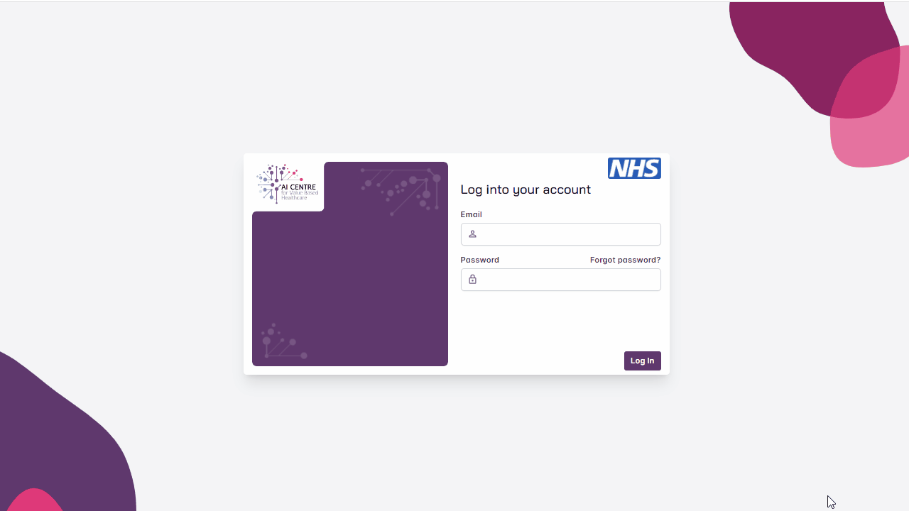

## Projects
The typical project flow involves the creation of a project, running a cohort query, staging
the project for approval, uploading the model plus any associated files and initiating the
training. Once training is complete the results of training can be downloaded.
Once logged in, you’ll be presented with the projects page. Here you can create new
projects, view projects that you have created or projects that you have been invited to
participate in.

### Create Project

*The first step of the research process is to create a project. Once created, you’ll be able to
add users to the project, perform a cohort query for your project and seek approval for the
model training. In the top right corner of the project page, select ‘Create Project’*

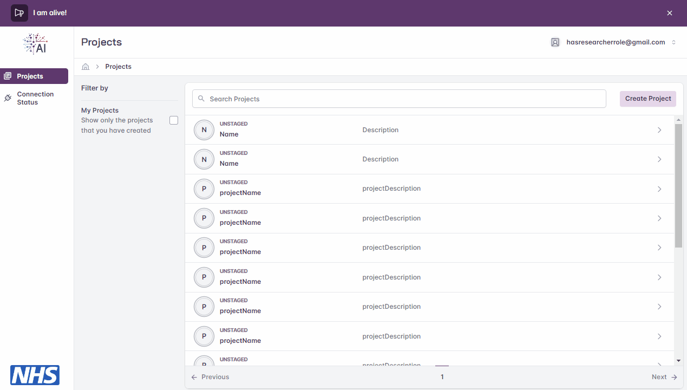

### Edit Project

Should you wish to edit the project, you can do so before staging the project (see section
below). Editing allows you to add users, change the name or description of the project or
delete the project.

You may optionally add other users to your project by entering their email address. Once
your project name, description and other users are provided select ‘Create Project’

### Delete Project

Should you wish to delete the project, you can do so at any time. This is done via the same modal
as Editing project. *Note*: You must be either the owner of the project or an administrator to perform this action

Any running training sessions will be deleted and no longer accessible.
The Images associated with the project will be deleted from XNAT and the project will no longer be visible within XNAT.

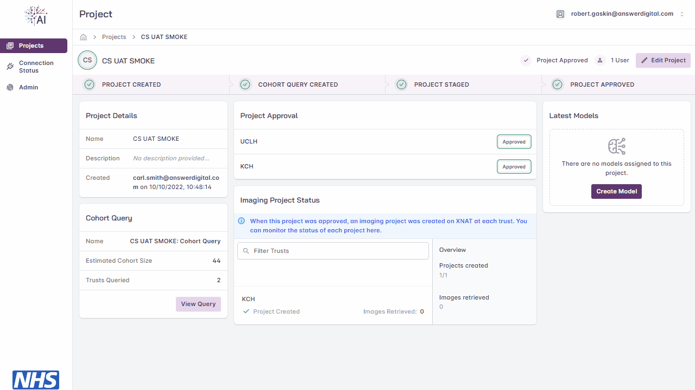

### Project List

All projects will be available from the home page of FLIP the project dashboard you can use filters to list only projects owned by
you or filter by the project name / description

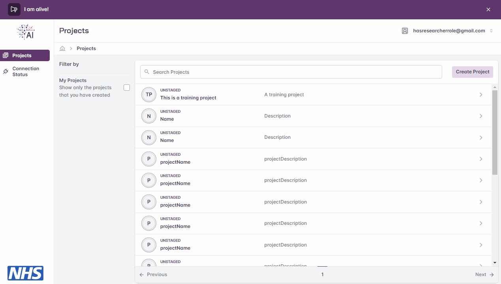

### Cohort

A Cohort is a SQL query that will be executed against the OMOP database. This will be used to identify the
Accession Ids that are a unique identifier of the sessions stored within the trusts PACs system which are associated with the Images (DICOM + NiFi)

#### Create Cohort

Once your project is created you’ll then need to create a cohort query. In the bottom left of
the screen select ‘Create Cohort Query’.

You can then provide a name for your query and enter it in SQL format
to perform a query on the OMOP database to identify a Cohort.

```sql
SELECT accession_id, concept_name, year_of_birth FROM omop.person p 
JOIN omop.radiology_occurrence r ON r.Person_Id = p.Person_Id
JOIN omop.concept c ON p.gender_concept_id = c.concept_id
WHERE year_of_birth < 1980
```

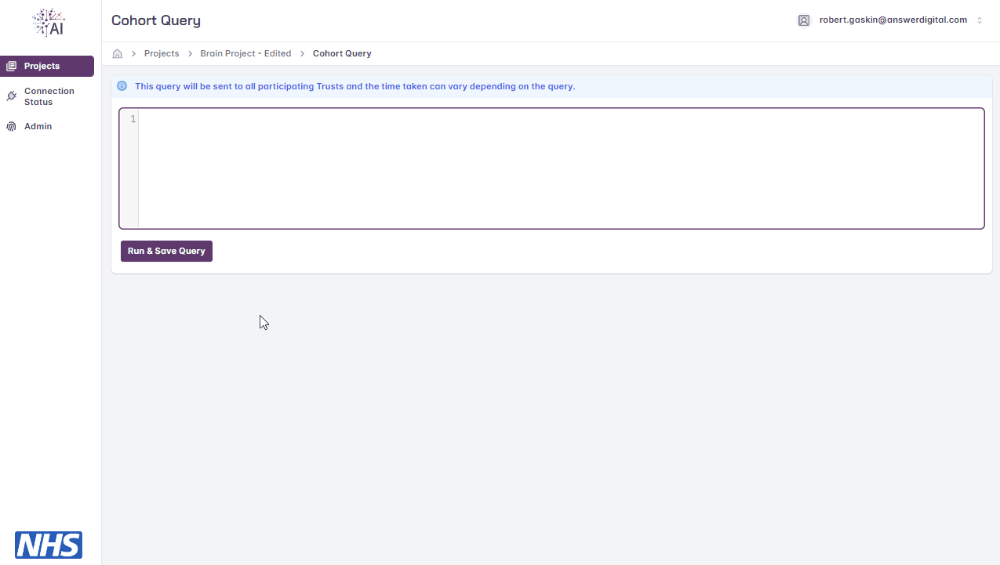

### Edit Cohort

While a project is not staged or beyond the Cohort can be edited. This can be done from the Projects Page
by clicking the 'View Query' button, the Cohort can be created as per the *Create Cohort* section.

### Project Staging

You’ll then be presented with the screen above, where you’ll need to ‘stage’ your project
by selecting ‘Stage Project’. Staging allows you to select which Trusts will be requested for
approval and included in the model training cycle. Use the toggle switch next to each
Trust to include / exclude each Trust. Once staged, the cohort query is locked in and sent
for approval by the FLIP administrator.

If, after staging, you need to amend your cohort query, contact your FLIP administrator.
Providing the project has not yet been approved they will be able to un-stage the project
you will be able to amend the cohort query and stage the project again.

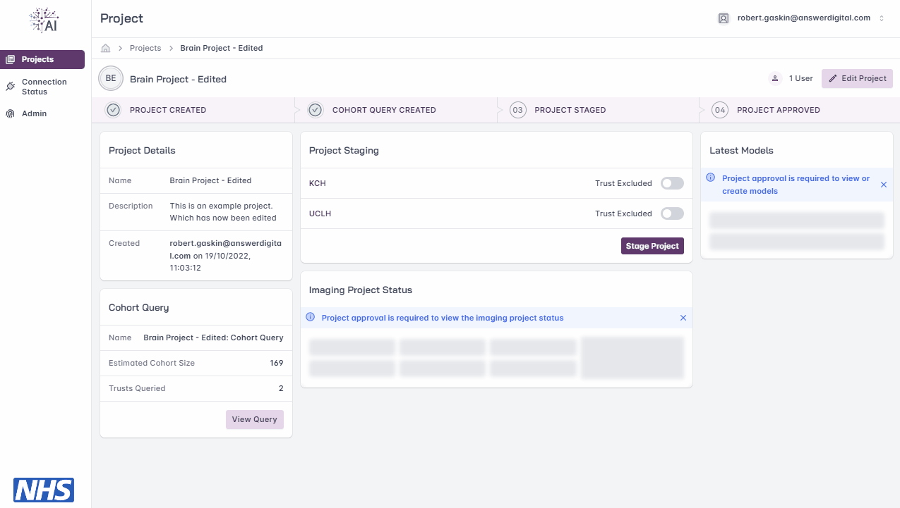

### Imaging Status

Once approved projects will be created on XNAT and the importing of accession numbers found in the Cohort Query will begin.
The Imaging Status Modal allows you to view the progress of which Images have imported. Including what Trusts projects have been created on
as well as how many Images have been imported from the underlying PACS system into XNAT.

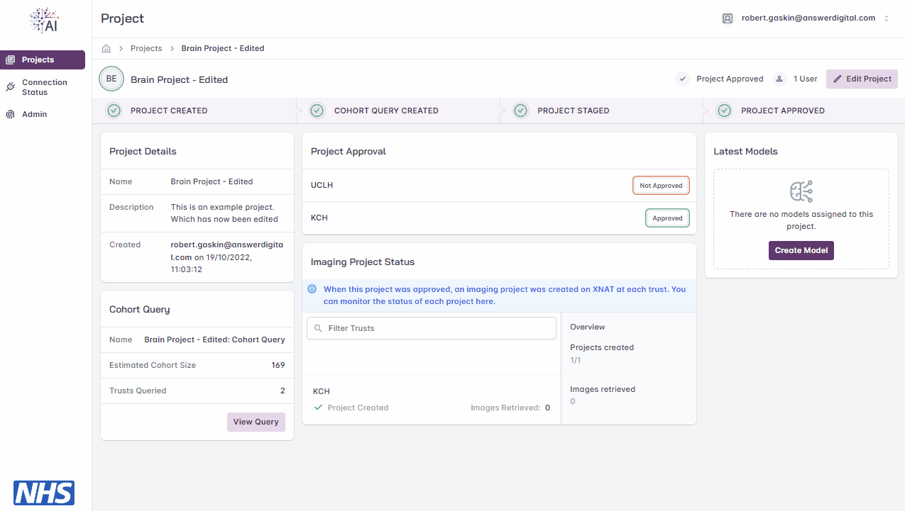

## Models

Once the project has been approved, you can begin creating models to facilitate training.


### Create Model

From within the project page select ‘Create Model’. You’ll be presented with the following where you can enter a name and brief description
for the model.

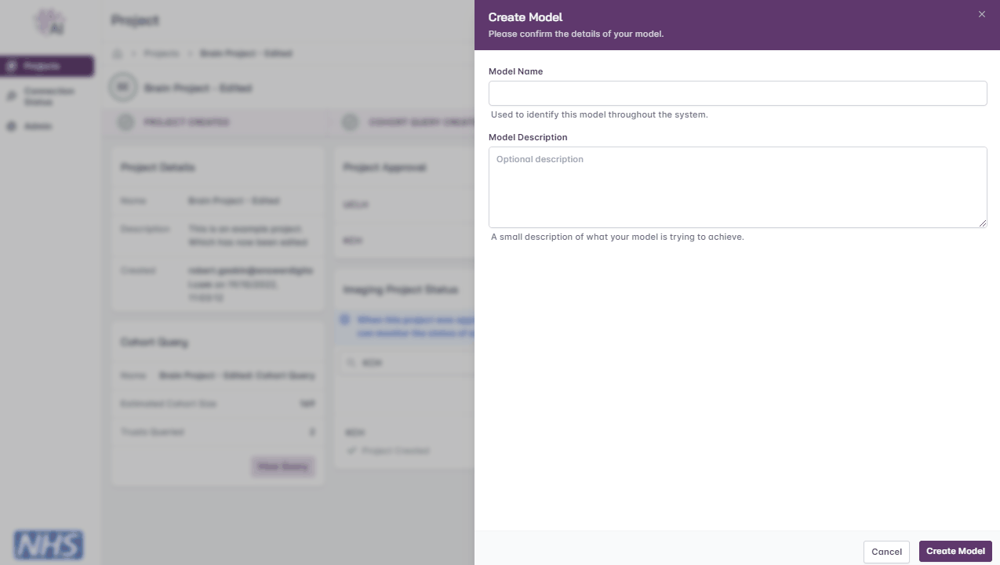

### Edit Model

You may edit the model by selecting the ‘Edit Model’ button. You may change the name and description
until training has been initiated.

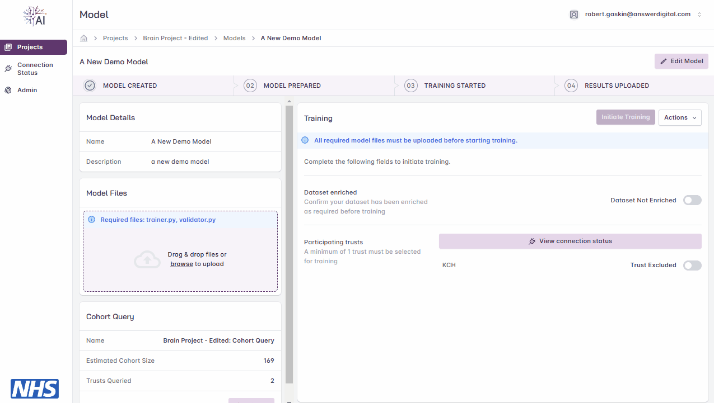

### Delete Model

You may delete the model by selecting the 'Edit Model' button, this action may be performed at any time.
Doing so while a model is training will Stop any current training.

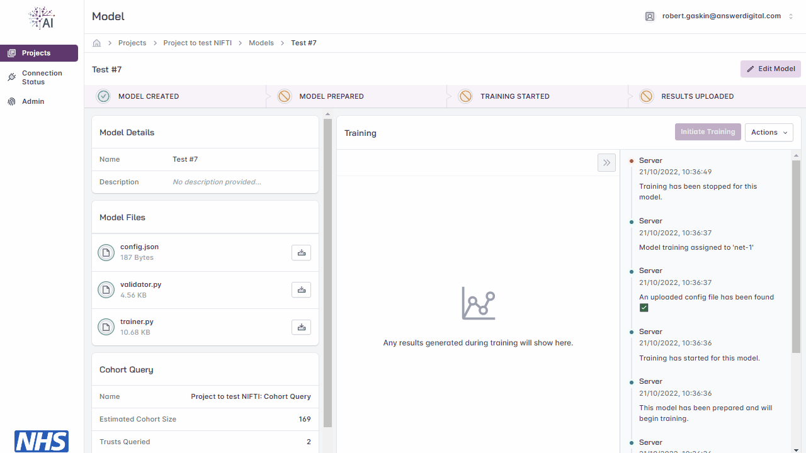

### Files

Files can be uploaded to a Model which are uploaded to the NVFlare application and used during training.

#### Upload Files

Model files can be uploaded using the uploader function on the left of the screen. Here you
may browse to the files available on your local machine or drag and drop them into the
box on screen. As files are uploaded, they are scanned for vulnerabilities / viruses. As a
minimum the following files are required:
- validator.py
- trainer.py

Creation of these files is done by a Model Developer the SDK for these files is located at:
https://github.com/AnswerConsulting/flip-sample-application

You’ll receive confirmation when your files have uploaded If you need to amend a file, you can do so locally and re-upload to overwrite
the previous version of the file.

It’s also possible to add additional files, should your model training need to reference
them, an example of this is in the section below.

#### Training Configuration

Prior to commencing training you may also upload a config.json file to control a number
of variables. The config file will define variables that are used during FLIP training (e.g.
GLOBAL_ROUNDS, LOCAL_ROUNDS, etc. in the attached example file).
An example of a config file below.

```json
{
  "GLOBAL_ROUNDS": 5,
  "LOCAL_ROUNDS": 2,
  "ROUND_HALF_UP": true,
  "LOSS_FUNCTION_START_VALUE": 1,
  "DAYS_OF_WEEK": [
    "mon",
    "tue",
    "wed",
    "thu",
    "fri",
    "sat",
    "sun"
  ]
}
```

#### View Files

The content of a file may be viewed at any time. This allows you to check the contents of a file that has been uploaded.

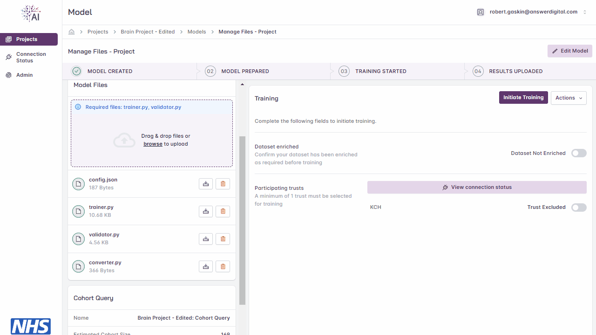

#### Delete Files

Files can also be deleted. To do this click the delete icon next the file on the Model page.

### Training

FLIP allows for multiple models to be deployed to and trained at multiple Trust sites
concurrently. To cater for this FLIP utilises NVIDIA Flare (NV Flare). NV Flare coordinates the
training, testing and aggregating at each of the relevant nodes and reports back to the
user interface once the training is complete.

FLIP uses the concept of ‘nets’ that are deployed on the central hub and remote hardware
at each Trust. Each ‘net’ consists of a controller and worker (to manage the model
training cycle) and FLIP uses a task scheduler to manage the resources available on the
hardware at Trust sites. The scheduler maintains a queue of waiting Tasks, when a Net
becomes free a Task is assigned to it. 

This scheduling capability means model developers
can submit their model for training via the UI and need not be concerned with matters
such as GPU capacity or existing jobs that are running/queued. When initiating training
the platform will check for available nets and assign the model training to an available
net

#### Initiate Training

When you have confirmed the dataset enrichment, configured local iterations and have
selected the participating Trusts, you are ready to start the training cycle. To do so, select
the ‘Initiate Training’ button.

Having initiated the training, the status bar will provide a status of training progress.

On the right-hand side of the page a window shows
detailed status updates with date & time stamps
against each activity.
The status messages show the scheduling activities,
including queuing, ‘net’ assignment, training in
progress and training complete.

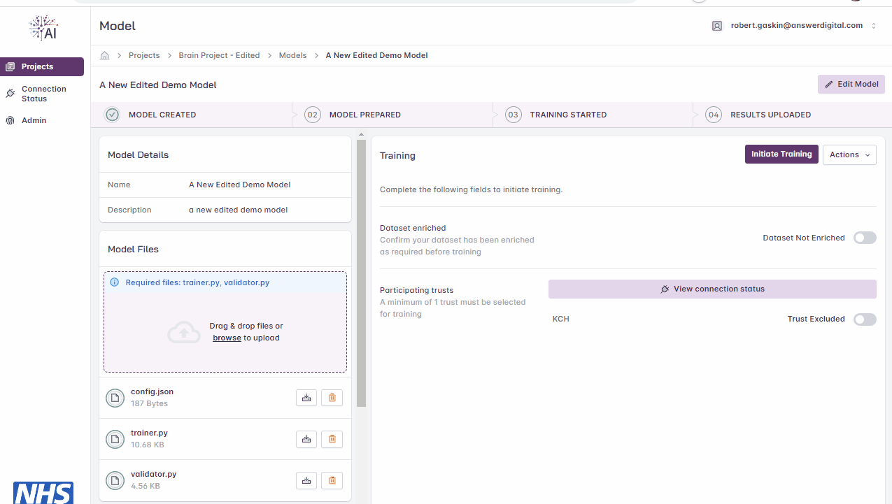

#### Stop Training

During training the progress bar will show the various stages of the training cycle, as each
stage completes a green tick will appear. Should you wish to stop the training, you may do
so when the ‘Training Started’ stage is in progress by selecting the ‘Actions Drop-down’ and
selecting ‘Stop Training’. When training has been stopped the progress bar will show
which stage the process was stopped at and appear like this:

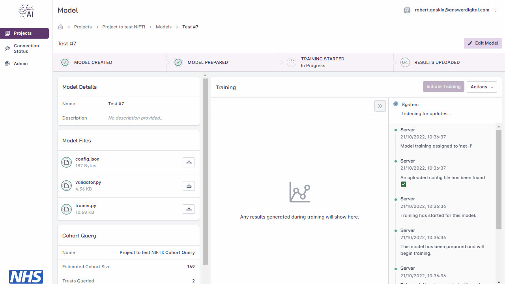

If the training has already completed the ‘Stop Training’ option will be greyed out (see
below).

#### View Results

Once training has completed, you may then download the results. Select Actions and
‘Download Results’, a zip file will then be downloaded to your local machine.

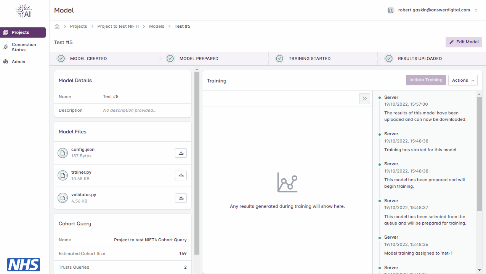

#### Metrics

During the training cycle any metrics specified by the model developer, such as loss
function, average score are displayed during and following the training cycle. Hovering
over the graphs at various points will display the values.

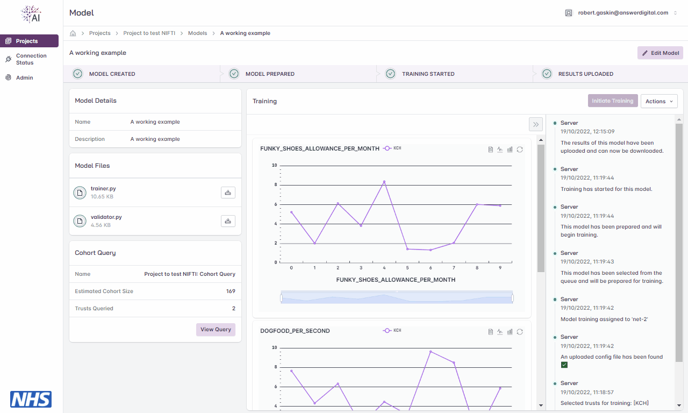
