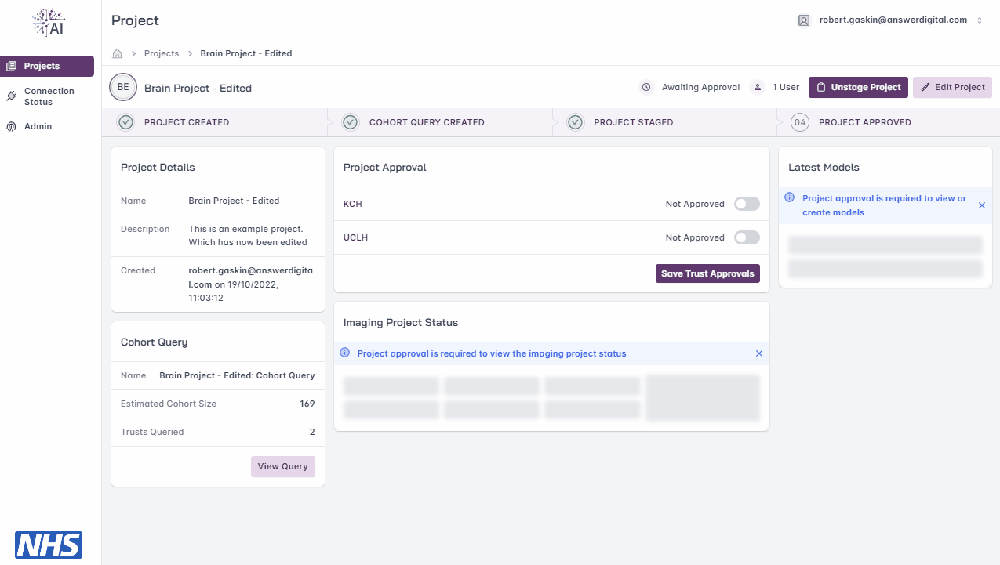
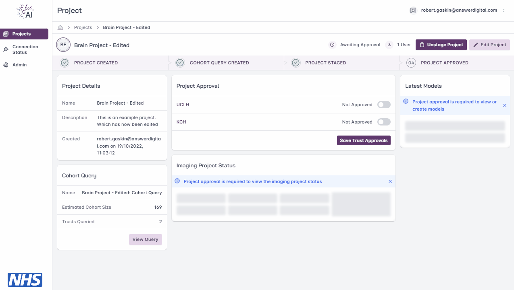
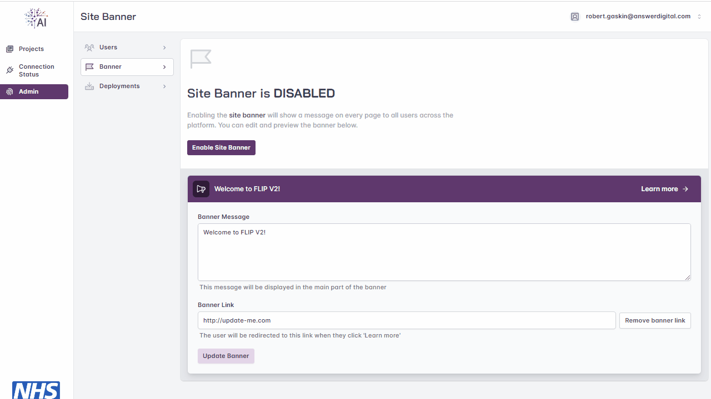
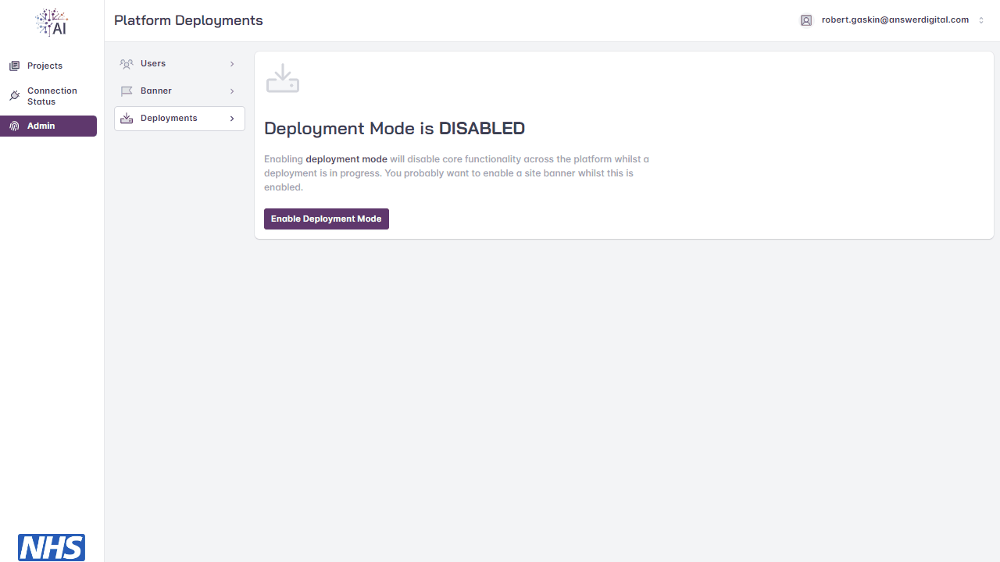
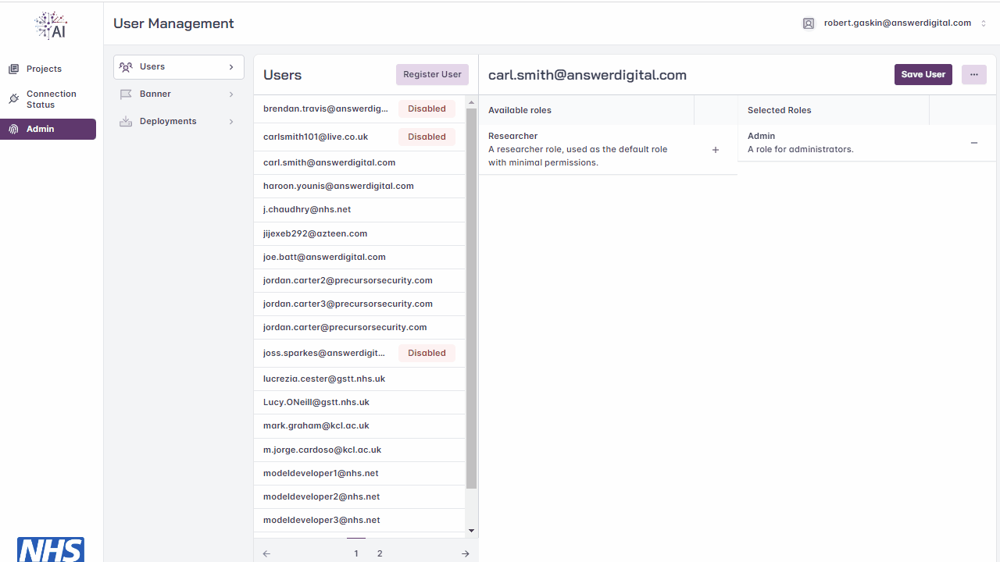
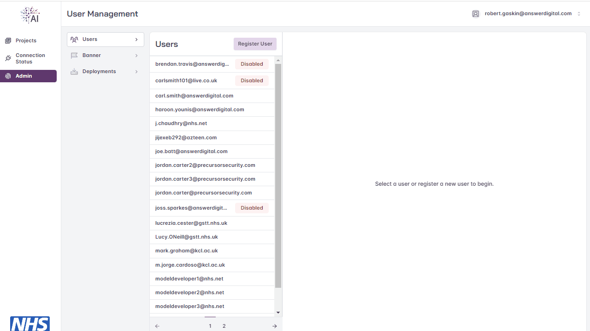
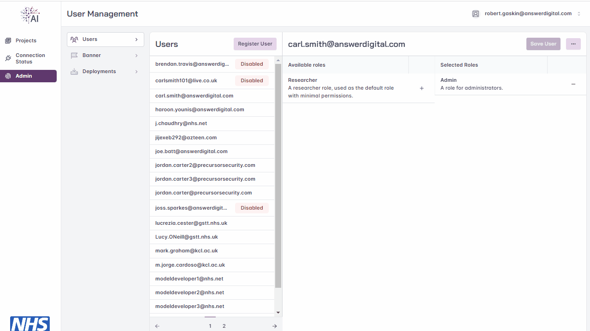
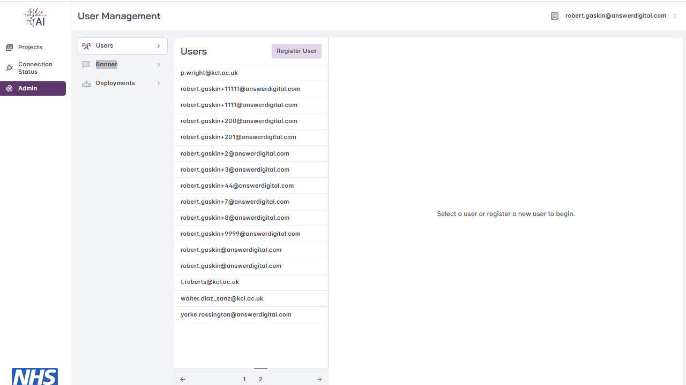

# Table of Contents
1. [Overview](#overview)
2. [Pre-Requisites](#pre-requisites)
3. [Step-by-Step Guide](#step-by-step-guide)
    - [Projects](#projects)
      - [Project Un-staging](#project-unstaging) 
      - [Project Approval](#project-approval)
    - [Site Management](#site-management)
      - [Site Banner](#site-banner)
      - [Deployment Mode](#deployment-mode)
    - [User Management](#user-management)
      - [Create User](#create-user)
      - [Access Control](#access-control)
      - [Role Management](#role-management)
      - [Password Reset](#password-reset)
4. [Linked Resources](#linked-resources)
5. [FAQs](#faqs)

# Overview
*This document contains instruction of the Administration of the FLIP Site, It's users and actions that may only be performed
by an Administrator.*

# Step-by-Step Guide

## Projects
The specific actions only available to an Administrator of a project.

### Project Un-staging

Model developers must ‘stage a project’ in order to get it approved and progress to
training of their model. Once the model developer stages their project, it will be locked
pending approval and they cannot change their cohort query details. Should the model
developer decide they need to amend the cohort query or edit the project name after
staging they may contact you to request this action. To do so, navigate to the project list,
select the specific project and, once in the project page, select ‘Unstage Project’.

Once unstaged the model developer may amend their cohort query, change the project
name & description, edit the project users or delete the project entirely.

### Project Approval

Once the offline approvals process has completed for each of the Trusts and you have
been informed of these approvals, you may then mark the project as approved for each
Trust within the user interface FLIP. In the example below there are two Trusts and each
has been marked as approved using the toggle switch next to each Trust. Marking as
approved allows the next stage of model training to commence and triggers the process
to retrieve images for the training cycle. The model developer will not be able to
initiate Training at a Trust that is not marked as approved.

## Site Management

Actions that can be performed by the Administrator that allow for site maintenance.

### Site Banner

The Site Banner allows you to have a message that is visible for all users of the FLIP Platform.
A Link may also be provided for the Site Banner which will allow so that when a user clicks the banner
they will be navigated to the specified URL.

The Site Banner may be enabled or disabled at any time.

### Deployment Mode

Deployment Mode will disable all non-administrator functions of the FLIP Platform, this allows you to disable the platform
While a deployment/maintenance on the Trusts Side is occurring. Deployment Mode can be enabled and disabled at any time.

## User Management

This section applies only to FLIP Administrator roles. The FLIP Administrator may add new
users, reset user passwords, change user roles and disable/re-enable users. There is no
concept of truly deleting users.

### Create User

On login the project list page will load by default. From the left side of the screen select
‘Manage Users’ and the list of users will be displayed. Next select ‘Register User’ and you’ll
be prompted to enter the user's email address and choose the role the user will have

Choose either Admin or Researcher (for model developer) roles. Then select ‘Register User’
and the user will be sent a one-time password to use when they first login.

### Access Control

Administrator roles may disable a user account, this does not delete the account and it
can subsequently be re-enabled. To disable a user account select the user from the list of
users, then select the button with 3 dots and choose the option to ‘Disable User’.

### Role Management

A user may have there roles changed at any time, select the user from the left hand window and add/remove
the Administrator/Researcher Role.

### Password Reset

Users can reset their own password, but Administrator roles may perform this for others if
requested. To do so, select the user from the list of users, then select the button with 3 dots
and choose the option to ‘Reset Password’.

